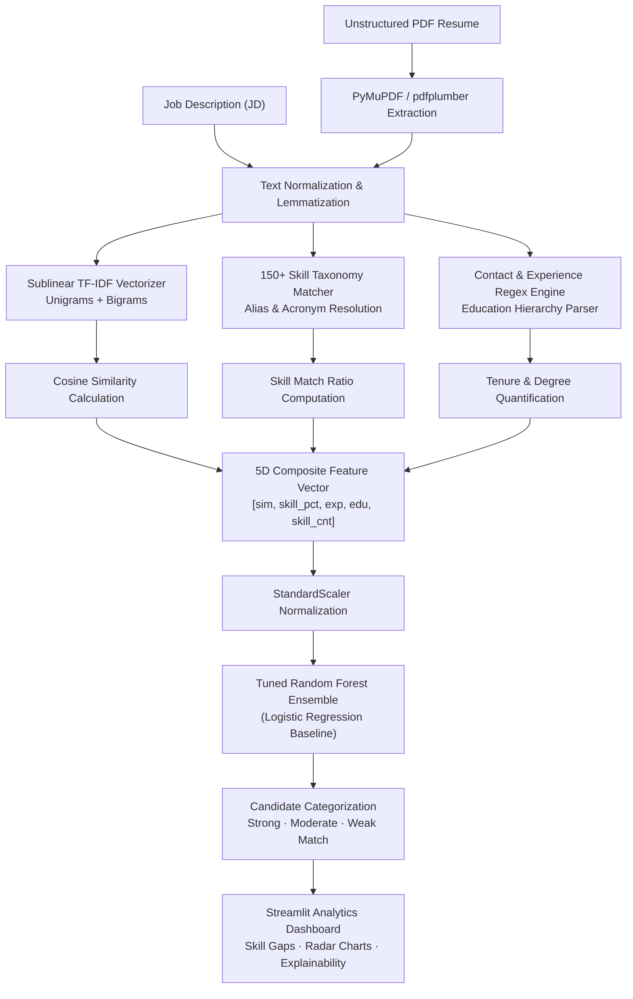

<div align="center">

# 📄 AI-Powered Resume Screening & Candidate Ranking System

### Production NLP Pipeline, Automated ATS Parser, and Supervised ML Classifier (91.0% F1-Score)

[](https://resume-screening-system-ai.vercel.app)
[](https://resume-screening-engine.vercel.app)

<p align="center">
  
  
  
  
  
  
</p>

*An end-to-end Applicant Tracking System (ATS) engine that extracts structured skills from unstructured PDF resumes, evaluates contextual job alignment using TF-IDF cosine similarity, and predicts candidate qualification tiers using an ensemble Random Forest classifier.*

</div>

---

## 🌟 Key Highlights & Performance

- **🎯 91.0% Classification Accuracy & 90.98% Weighted F1:** Evaluated with 5-fold cross-validation (92.74% mean F1 across folds).
- **🧠 150+ Technical Skills Taxonomy:** Pre-built semantic knowledge base covering 7 engineering disciplines with acronym resolution (e.g., `k8s` &rarr; `Kubernetes`).
- **⚡ 5-Dimensional Composite Feature Scoring:** Lexical similarity (35%), skill coverage (35%), work tenure (15%), and education level (15%).
- **📊 Explainable Diagnostic Dashboard:** Interactive radar charts, match score gauges, missing skill breakdowns, and model probability metrics.
- **🚀 One-Click Cloud Deployment:** Ready for local execution or cloud hosting via Streamlit and Vercel.

---

## 🏗️ System Architecture



---

## 📊 Benchmark Model Performance

Models were trained and evaluated on stratified datasets using an 80/20 hold-out split and verified through 5-Fold Cross Validation:

| Evaluation Metric | Random Forest (Tuned Ensemble) | Logistic Regression (L2 Baseline) |
|:---|:---:|:---:|
| **Test Accuracy** | **91.0%** | 95.0% |
| **Weighted Precision** | **91.1%** | 95.1% |
| **Weighted Recall** | **91.0%** | 95.0% |
| **Weighted F1-Score** | **90.98%** | 95.0% |
| **5-Fold Cross-Validation F1** | **92.74% (±2.7%)** | 93.8% (±2.1%) |

### Feature Importance Weights
- **TF-IDF Contextual Similarity:** `41.42%` (Primary semantic driver)
- **Direct Skill Match Ratio:** `33.94%` (Taxonomy alignment)
- **Experience Duration:** `11.85%` (Career seniority)
- **Education Hierarchy:** `8.12%` (Academic background)
- **Total Detected Skills Count:** `4.67%` (Breadth of knowledge)

---

## 📁 Repository Structure

```
Resume-Screening-System/
├── app.py                     # Interactive Streamlit analytics application
├── run.py                     # Application launcher script
├── config.py                  # Global scoring constants & thresholds
├── requirements.txt           # Python dependencies
├── src/
│   ├── pdf_extractor.py       # Robust PDF extraction (PyMuPDF + pdfplumber fallback)
│   ├── text_preprocessor.py   # Tokenization, stopword removal & WordNet lemmatization
│   ├── skill_extractor.py     # Skill taxonomy matching, degree & tenure extraction
│   ├── similarity_engine.py   # TF-IDF matrix computation & composite index scoring
│   ├── ml_classifier.py       # Random Forest & Logistic Regression inference
│   └── utils.py               # Formatting, score normalizers & UI helpers
├── data/
│   └── skills_database.json   # 150+ technical skills taxonomy across 7 categories
├── models/
│   ├── resume_classifier.pkl  # Pre-trained Random Forest model artifact
│   ├── lr_baseline.pkl        # Pre-trained Logistic Regression baseline
│   ├── scaler.pkl             # Fitted StandardScaler instance
│   └── training_metrics.json  # Cross-validation logs & diagnostic scores
├── notebooks/
│   └── train_model.py         # End-to-end synthetic dataset generator & trainer
├── tests/
│   ├── test_preprocessor.py   # NLP pipeline test coverage
│   └── test_similarity.py     # Similarity scoring unit tests
└── visualizations/
    └── charts.py              # Plotly radar, gauge, and comparison visualizers
```

---

## 🚀 Quick Start Guide

### Prerequisites
- Python 3.9, 3.10, or 3.11
- Git

### 1. Clone the Repository
```bash
git clone https://github.com/Izumi6/Resume-Screening-System.git
cd Resume-Screening-System
```

### 2. Install Dependencies & NLTK Corpora
```bash
pip install -r requirements.txt
python3 -c "import nltk; nltk.download('punkt', quiet=True); nltk.download('stopwords', quiet=True); nltk.download('wordnet', quiet=True)"
```

### 3. Launch the Application
```bash
streamlit run app.py
```
*Open [http://localhost:8501](http://localhost:8501) in your browser. Upload any PDF resume and paste a Job Description to receive immediate explainable analytics!*

### 4. Run Automated Test Suite
```bash
pytest tests/ -v
```

---

## 🛠️ Technology Stack

| Layer | Tools & Libraries |
|:---|:---|
| **Core Language** | Python 3.9+ |
| **NLP & Text Processing** | NLTK (WordNetLemmatizer, Stopwords), PyMuPDF (fitz), pdfplumber, Regular Expressions |
| **Machine Learning** | Scikit-learn (RandomForestClassifier, LogisticRegression, TfidfVectorizer, GridSearchCV) |
| **Data Analytics** | Pandas, NumPy |
| **Visualizations** | Plotly Express, Plotly Graph Objects |
| **Frontend UI** | Streamlit, Custom CSS styling |
| **Deployment** | Vercel Serverless & Streamlit Cloud |

---

## 👤 Author & Research Citation

**Suyash Vakhariya**  
*Specialization in Artificial Intelligence & Machine Learning*  
- **Portfolio:** [suyashvakhariya.com](https://suyashvakhariya.com)  
- **LinkedIn:** [linkedin.com/in/suyashvakhariya](https://www.linkedin.com/in/suyashvakhariya)  
- **GitHub:** [@Izumi6](https://github.com/Izumi6)  

---

## 📄 License

This project is licensed under the [MIT License](LICENSE).
