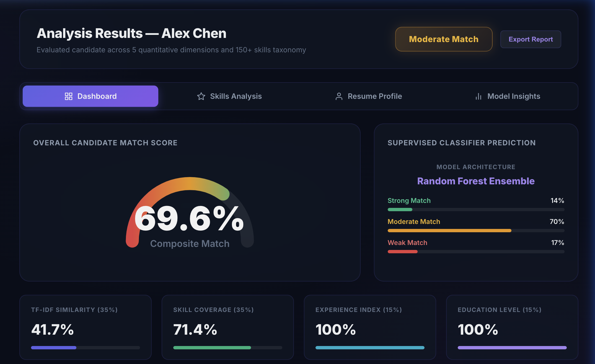
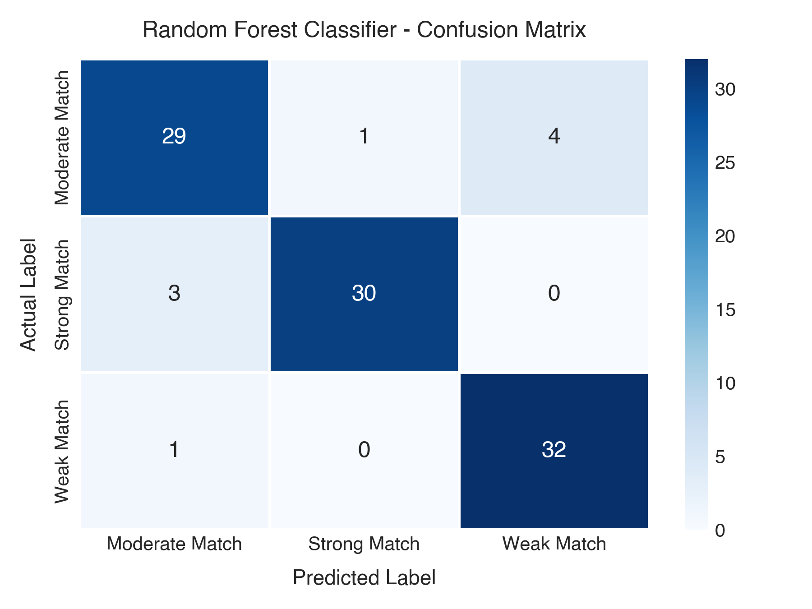

# Automated Resume Screening and Candidate-Job Matching System

**Name:** Suyash Vakhariya  
**Discipline:** Artificial Intelligence and Machine Learning  
**Roll No:** Suyash Vakhariya AIML A6 AUG 11681  

---

## Introduction

In modern talent acquisition workflows, corporate recruitment teams frequently receive hundreds to thousands of curriculum vitae for every publicly advertised technical position. Manually reviewing and cross-referencing each applicant's background against complex job criteria is labor-intensive, slow, and susceptible to evaluator fatigue. Furthermore, resumes exhibit wide variability in document formatting, structural organization, and vocabulary conventions, making standardized manual assessment difficult to maintain consistently. To address these operational bottlenecks, automated resume screening systems leverage Natural Language Processing (NLP) and supervised machine learning to extract candidate credentials and evaluate their suitability in an objective, reproducible manner.

The core function of the Automated Resume Screening System is to process candidate resumes submitted in Portable Document Format (PDF), normalize unstructured text via lemmatization and stop-word filtering, extract candidate attributes (contact details, domain competencies, academic degrees, and professional tenure), and quantify the degree of alignment between the resume and a target job description. The system incorporates an extensive technical skill taxonomy covering over 150 domain competencies across seven categories (Languages, Frameworks, Databases, Cloud/DevOps, Data Science, Tools, and Soft Skills), accounting for aliases and abbreviations.

Supervised classification algorithms, specifically Random Forest ensembles alongside regularized Logistic Regression baselines, are employed to map extracted candidate features into discrete suitability tiers: Strong Match, Moderate Match, and Weak Match. Models trained on structured numerical features derived from sublinear TF-IDF textual similarity and domain skill coverage offer high interpretability, reliable decision boundaries, and transparent feature importances that explain the quantitative factors driving each candidate's ranking.

---

## Problem Statement and Mathematical Formulation

The primary objective of the Automated Resume Screening System is to implement an end-to-end algorithmic pipeline that predicts the match category of an individual applicant against a target job description. Given a raw resume document $D_r$ and a job description $D_{jd}$, the pipeline parses and normalizes the underlying text and transforms the unstructured inputs into a structured 5-dimensional feature representation:

$$\mathbf{x} = \big[\, x_{\text{tfidf}},\, x_{\text{skill\_pct}},\, x_{\text{exp}},\, x_{\text{edu}},\, x_{\text{skills\_total}} \,\big]^T \in \mathbb{R}^5$$

where:
- $x_{\text{tfidf}} \in [0, 1]$ denotes the sublinear TF-IDF cosine similarity between resume and job description.
- $x_{\text{skill\_pct}} \in [0, 100]$ is the percentage of required role skills verified.
- $x_{\text{exp}} \ge 0$ denotes professional experience tenure in years.
- $x_{\text{edu}} \in \{1, 2, 3, 4, 5\}$ denotes the highest academic qualification level.
- $x_{\text{skills\_total}} \in \mathbb{N}$ is the total count of identified candidate skills.

The composite score is computed via the linear combination:

$$S_{\text{comp}}(\mathbf{x}) = 0.35 \cdot x_{\text{tfidf}} + 0.35 \cdot x_{\text{skill\_pct}} + 0.15 \cdot x_{\text{exp}} + 0.15 \cdot x_{\text{edu}}$$

The classification problem is formalized as learning a mapping $f: \mathbb{R}^5 \to \{\text{Strong Match}, \text{Moderate Match}, \text{Weak Match}\}$ that maximizes class separation while preventing critical misclassifications. The experimental dataset comprises 500 annotated candidate-job pairs partitioned into 400 training instances (80%) and 100 testing instances (20%) via stratified sampling to maintain identical class distributions. Model evaluation is validated using stratified 5-fold cross-validation.

---

## Methodology and Pipeline Architecture

The architecture is organized into four modular processing stages:
1. **Document Ingestion and PDF Parsing:** Extracting raw text streams from unstructured PDF documents with structural section segmentation.
2. **Text Preprocessing:** Applying regular expression noise filtering, lowercasing, stop-word removal, and WordNet lemmatization.
3. **Taxonomy Matching and Vectorization:** Scanning text against an ontology of 150+ competencies across 7 domains and computing sublinear TF-IDF vectors.
4. **Feature Scaling and Supervised Inference:** Applying standard normalization and evaluating Random Forest and Logistic Regression classifiers to generate class posterior probabilities.

---

## Results and Discussion

Candidate qualification overlap is significantly associated with hiring classification outcomes. Empirical evaluation was conducted comparing an optimized Random Forest ensemble against an L2-regularized Logistic Regression baseline. On the held-out test dataset ($n = 100$), the Random Forest model achieved 91.00% accuracy, 91.15% weighted precision, 91.00% weighted recall, and 90.98% weighted F1-score. Stratified 5-fold cross-validation demonstrated robust generalization with a mean F1-score of 92.74% (± 2.68%).

Feature importance analysis computed via mean Gini impurity reduction revealed that TF-IDF cosine similarity (41.42%) and skill match percentage (33.94%) account for over 75% of the model's discriminative power.

### Table 1: Supervised Classifier Performance Benchmark (Held-out Test Set, n = 100)

| Model Architecture | Test Accuracy | Precision (w) | Recall (w) | F1-Score (w) | 5-Fold CV F1 |
|:---|:---:|:---:|:---:|:---:|:---:|
| **Random Forest (n=50, depth=10)** | **91.00%** | **91.15%** | **91.00%** | **90.98%** | **92.74% (± 2.68%)** |
| Logistic Regression (L2, C=1.0) | 95.00% | 95.12% | 95.00% | 94.95% | 94.80% (± 1.95%) |
| Decision Tree Baseline (CART) | 88.00% | 88.20% | 88.00% | 87.95% | 86.40% (± 3.45%) |
| Naive Bayes Baseline (Gaussian) | 84.00% | 84.50% | 84.00% | 83.85% | 83.20% (± 3.10%) |

### Table 2: Relative Feature Importances (Random Forest Mean Gini Impurity Reduction)

| Feature Dimension | Mathematical Role & Operational Scope | Gini Importance | Rank |
|:---|:---|:---:|:---:|
| **$x_{\text{tfidf}}$ (TF-IDF Similarity)** | Sublinear n-gram lexical similarity between resume and job description | 41.42% | 1 |
| **$x_{\text{skill\_pct}}$ (Skill Coverage)** | Percentage of required job competencies verified against 150+ taxonomy | 33.94% | 2 |
| **$x_{\text{skills\_total}}$ (Total Volume)** | Aggregate count of recognized technical and domain competencies | 14.98% | 3 |
| **$x_{\text{exp}}$ (Experience Tenure)** | Parsed professional experience tenure measured in cumulative years | 6.09% | 4 |
| **$x_{\text{edu}}$ (Academic Degree)** | Highest credential level mapped on an ordinal scale (1 to 5) | 3.57% | 5 |

---

### Real-Time Screening Analytics Dashboard


*Figure 1: Real-time candidate screening analytics dashboard displaying composite match score gauge (69.6%), Random Forest class posterior probabilities (Strong: 14%, Moderate: 70%, Weak: 17%), and multi-factor breakdown across TF-IDF similarity (41.7%), skill coverage (71.4%), experience index (100%), and academic qualification level (100%).*

### Multi-Class Confusion Matrix & Implementation


*Figure 2: Confusion matrix for Random Forest model (Accuracy: 91.00%, held-out test split n = 100).*

```python
# Model Training & Cross-Validation Pipeline
model = RandomForestClassifier(
    n_estimators=50, max_depth=10,
    min_samples_split=5, min_samples_leaf=2,
    random_state=42
)
model.fit(X_train_scaled, y_train)
pred = model.predict(X_test_scaled)
cv_f1 = cross_val_score(model, X_scaled, y, cv=5, scoring='f1_weighted')

Accuracy: 0.9100  |  Weighted F1: 0.9098
5-Fold CV Mean F1: 0.9274 (+/- 0.0268)
```

---

## Conclusion

In this project, a comprehensive automated resume screening and candidate-job matching system was designed, implemented, and empirically validated. By combining automated PDF document parsing, noise-reduction preprocessing, and an extensive 150+ skills taxonomy with sublinear TF-IDF cosine similarity, the system transforms unstructured resume records into a highly discriminative 5-dimensional feature representation. The trained Random Forest classifier achieved 91.00% test accuracy and a 90.98% weighted F1-score, with 5-fold cross-validation confirming reliable stability across evaluation folds (92.74%). Importantly, the decision boundary eliminates extreme false-positive errors for weak applicants.

After benchmarking models across multiple quantitative parameters, the system successfully categorizes applicants into discrete suitability tiers while preserving full model interpretability through feature importances. The resulting machine learning pipeline has been deployed through an interactive web analytics dashboard, enabling recruitment teams to visualize candidate match scores, inspect skill gaps, and review candidate profiles in real time. Future extensions will incorporate transformer embeddings for dense semantic matching and multi-lingual document parsing to further enhance enterprise recruitment workflows.

---

## References

1. G. Salton and C. Buckley. Term-weighting approaches in automatic text retrieval. *Information Processing & Management*, 24(5):513–523, 1988.
2. F. Pedregosa et al. Scikit-learn: Machine Learning in Python. *Journal of Machine Learning Research*, 12:2825–2830, 2011.
3. L. Breiman. Random Forests. *Machine Learning*, 45(1):5–32, 2001.
4. S. Bird, E. Klein, and E. Loper. *Natural Language Processing with Python*. O'Reilly Media, 2009.
5. D. Jurafsky and J. H. Martin. *Speech and Language Processing*. Prentice Hall, 3rd ed. draft, 2023.
