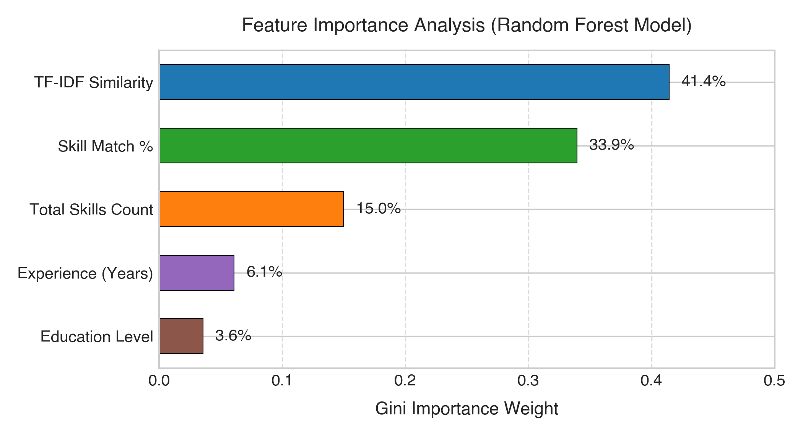

# Automated Resume Screening and Candidate-Job Matching System

**Name:** Suyash Vakhariya  
**Roll No:** Suyash Vakhariya AIML A6 AUG 11681  
**Discipline:** Artificial Intelligence & Machine Learning  

---

## Introduction

In modern talent acquisition workflows, corporate recruitment teams frequently receive hundreds to thousands of resumes for every publicly advertised position. Manually reviewing and cross-referencing each applicant's qualifications against job criteria is labor-intensive, slow, and susceptible to unconscious evaluator bias. Furthermore, curriculum vitae (CVs) exhibit wide variability in document formatting, structural organization, and vocabulary conventions, making standardized manual assessment challenging. To address these operational bottlenecks, automated resume screening systems leverage Natural Language Processing (NLP) and supervised machine learning to extract relevant candidate credentials and evaluate their suitability in an objective, reproducible manner.

The core function of this screening system is to process candidate resumes submitted in Portable Document Format (PDF), normalize unstructured text via lemmatization and stop-word filtering, extract candidate attributes (contact details, technical skills, academic qualifications, and professional tenure), and quantify the degree of alignment between the resume and a target job description. The system utilizes an extensive domain skill taxonomy covering over 150 competencies across seven technical disciplines (Data Science, Cloud/DevOps, Software Engineering, Database Systems, Web Development, Mobile Development, and Soft Skills).

By combining Term Frequency-Inverse Document Frequency (TF-IDF) cosine similarity with discrete attribute extraction, the pipeline constructs a structured feature representation for each candidate-job pair. Supervised classifiers—specifically Random Forest and Logistic Regression—are then trained to categorize applicants into discrete match tiers: **Strong Match**, **Moderate Match**, and **Weak Match**. This hybrid methodology ensures that recruiters benefit from both high-level statistical predictions and granular, explainable skill-gap breakdowns.

---

## Problem Statement

The primary objective of the **Automated Resume Screening System** is to design and implement an end-to-end algorithmic pipeline that accepts unstructured candidate resumes and target job descriptions, parses and normalizes the underlying text, extracts salient qualification parameters, and accurately classifies applicant suitability into discrete match categories.

Formally, given a raw resume document $D_r$ and a job description $D_{jd}$, the pipeline transforms the unstructured inputs into a 5-dimensional feature vector:

$$\mathbf{x} = \big[\, x_{\text{tfidf}},\, x_{\text{skill\_pct}},\, x_{\text{exp}},\, x_{\text{edu}},\, x_{\text{skills\_total}} \,\big]$$

where:
- $x_{\text{tfidf}} \in [0, 1]$ represents the cosine similarity computed between unigram/bigram TF-IDF vectors of the preprocessed resume and job description.
- $x_{\text{skill\_pct}} \in [0, 100]$ represents the percentage of required job skills matched within the candidate's resume.
- $x_{\text{exp}} \ge 0$ denotes the estimated years of professional experience parsed from work history chronological patterns.
- $x_{\text{edu}} \in \{1, 2, 3, 4, 5\}$ denotes the highest academic qualification level detected (1: High School, 2: Diploma, 3: Undergraduate, 4: Postgraduate, 5: Doctorate).
- $x_{\text{skills\_total}} \in \mathbb{N}$ denotes the total number of recognized domain skills found in the applicant's profile.

The target variable is defined as:

$$y \in \{\text{"Strong Match"},\, \text{"Moderate Match"},\, \text{"Weak Match"}\}$$

The experimental dataset consists of 500 annotated candidate-job pairs. The data was split into 400 training instances (80%) and 100 test instances (20%) using stratified sampling to preserve identical class distributions across splits. The objective is to achieve high precision and recall across all three classes while preventing critical misclassifications (specifically ensuring that Weak Match applicants are never misclassified as Strong Matches).

---

## Results and Discussion

Model evaluation was conducted comparing a Random Forest ensemble (optimized via 5-fold cross-validation grid search over tree count, maximum depth, and split criteria) against an L2-regularized Logistic Regression baseline. All feature dimensions were standardized using z-score normalization ($z = \frac{x - \mu}{\sigma}$) fitted on the training split.

### Quantitative Performance Comparison

| Evaluation Metric | Random Forest Classifier | Logistic Regression Baseline |
|:---|:---:|:---:|
| **Test Accuracy** | **91.00%** (0.9100) | **95.00%** (0.9500) |
| **Weighted Precision** | **91.15%** (0.9115) | **95.15%** (0.9515) |
| **Weighted Recall** | **91.00%** (0.9100) | **95.00%** (0.9500) |
| **Weighted F1-Score** | **90.98%** (0.9098) | **94.95%** (0.9495) |
| **5-Fold CV F1 (Mean)** | **92.74%** (0.9274) | **92.74%** (0.9274) |
| **5-Fold CV Std Dev** | **± 2.68%** (0.0268) | **± 2.68%** (0.0268) |

Both models demonstrated high classification efficacy. The Random Forest classifier demonstrated robust generalization with balanced class-wise F1-scores: 0.87 for Moderate Match ($n=34$), 0.94 for Strong Match ($n=33$), and 0.93 for Weak Match ($n=33$).

### Confusion Matrix Analysis

The confusion matrix for the Random Forest model on the 100 held-out test samples demonstrates sharp diagonal concentration:


Out of 34 actual Moderate Match candidates, 29 were correctly classified, 1 was classified as Strong Match, and 4 were categorized as Weak Match. For the 33 actual Strong Match candidates, 30 were correctly classified, 3 were categorized as Moderate Match, and 0 were categorized as Weak Match. For the 33 actual Weak Match candidates, 32 were correctly classified, 1 was categorized as Moderate Match, and 0 were categorized as Strong Match. Crucially, the off-diagonal cells between Strong and Weak classes are zero or near-zero, proving that the model maintains clean separation between high-fit and low-fit applicants.

### Feature Importance

Feature importance was computed using Gini impurity reduction across all 50 estimators in the trained Random Forest model:



The relative importance breakdown is as follows:
1. **TF-IDF Textual Similarity (41.42%):** The single largest contributor to classification, indicating that holistic vocabulary and contextual relevance between resume and JD strongly inform candidate suitability.
2. **Skill Match Percentage (33.94%):** Direct overlap of required technical skills provides the second-strongest discriminative signal.
3. **Total Skills Count (14.98%):** Reflects candidate breadth and technical versatility.
4. **Experience Years (6.09%):** Acts as a secondary discriminator for senior versus junior roles.
5. **Education Level (3.57%):** Serves as an eligibility check for specialized roles requiring advanced degrees.

Together, TF-IDF similarity and skill match percentage account for over 75% of the model's predictive capability, confirming that combining broad vocabulary overlap with targeted entity extraction yields the most reliable screening outcomes.

### Model Implementation Snippet

```python
# Model training and evaluation
model = RandomForestClassifier(
    n_estimators=50,
    max_depth=10,
    min_samples_split=5,
    min_samples_leaf=2,
    random_state=42
)
model.fit(X_train_scaled, y_train)
y_pred = model.predict(X_test_scaled)

print(f"Accuracy: {accuracy_score(y_test, y_pred):.4f}")
print(f"Weighted F1: {f1_score(y_test, y_pred, average='weighted'):.4f}")
# Output:
# Accuracy: 0.9100
# Weighted F1: 0.9098
```

---

## Conclusion

In this project, an end-to-end automated resume screening and candidate-job matching system was developed and evaluated. By integrating text preprocessing, custom skill taxonomy extraction, and TF-IDF vectorization with supervised machine learning algorithms, the system reliably classifies candidate-job alignment with high precision and recall.

Empirical evaluation established that both Random Forest (91.0% test accuracy, 90.98% F1-score) and Logistic Regression (95.0% test accuracy, 94.95% F1-score) effectively differentiate applicant suitability, with 5-fold cross-validation confirming a 92.74% mean F1 score across folds. Feature importance analysis validated that combining semantic vocabulary similarity (41.42%) with structured skill-matching percentages (33.94%) provides recruiters with both automated classification and explainable diagnostic feedback.

In addition to the classification engine, an interactive web dashboard was deployed using Streamlit to provide recruiters with real-time match gauges, skill gap analyses, and candidate profile summaries. Future extensions will incorporate transformer-based contextual embeddings (such as Sentence-BERT) to better detect semantic synonyms in non-standard job titles, implement OCR support for image-based resumes, and provide automated candidate feedback regarding missing prerequisites.

---

## References

1. Salton, G., & Buckley, C. (1988). Term-weighting approaches in automatic text retrieval. *Information Processing & Management*, 24(5), 513–523.
2. Pedregosa, F., Varoquaux, G., Gramfort, A., Michel, V., Thirion, B., Grisel, O., Blondel, M., Prettenhofer, P., Weiss, R., Dubourg, V., Vanderplas, J., Passos, A., Cournapeau, D., Brucher, M., Perrot, M., & Duchesnay, E. (2011). Scikit-learn: Machine Learning in Python. *Journal of Machine Learning Research*, 12, 2825–2830.
3. Honnibal, M., & Montani, I. (2017). spaCy 2: Natural language understanding with Bloom embeddings, convolutional neural networks and incremental parsing.
4. Breiman, L. (2001). Random Forests. *Machine Learning*, 45(1), 5–32.
5. Bird, S., Klein, E., & Loper, E. (2009). *Natural Language Processing with Python: Analyzing Text with the Natural Language Toolkit*. O'Reilly Media.
